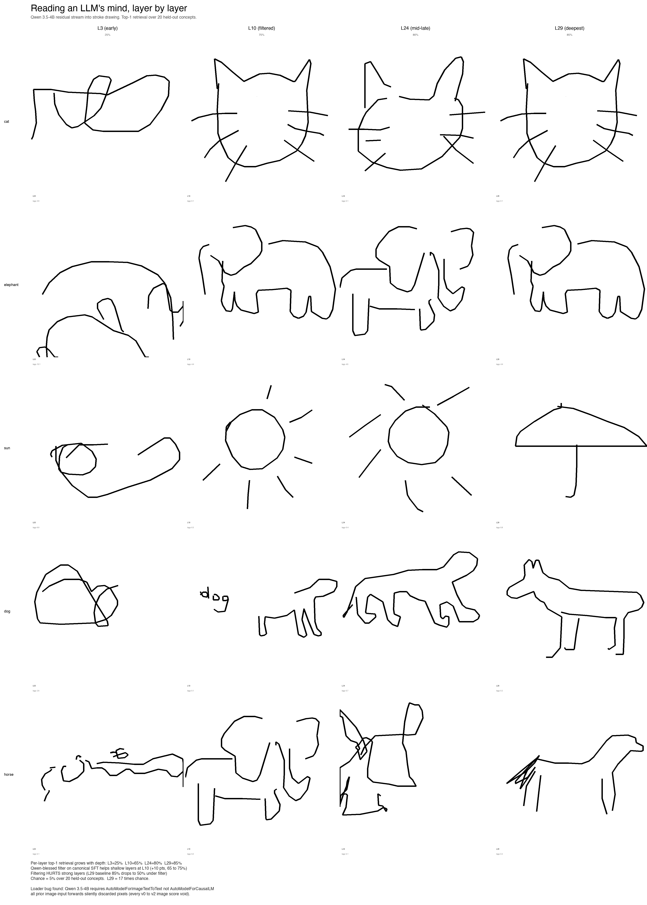
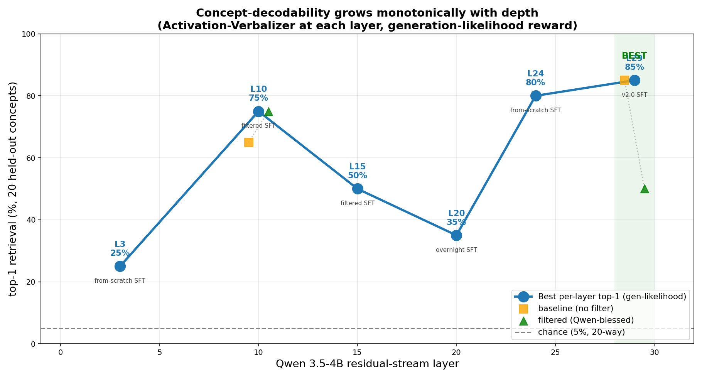
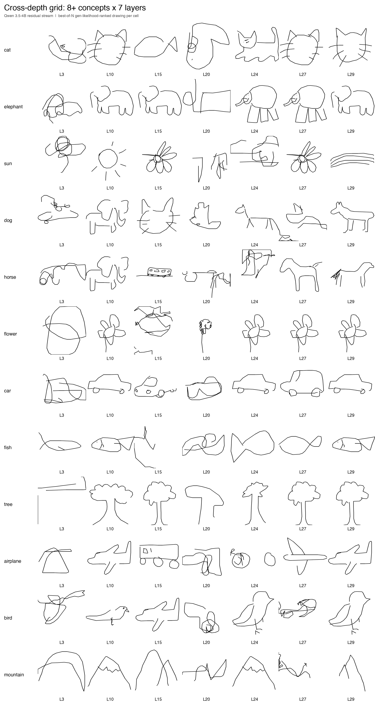
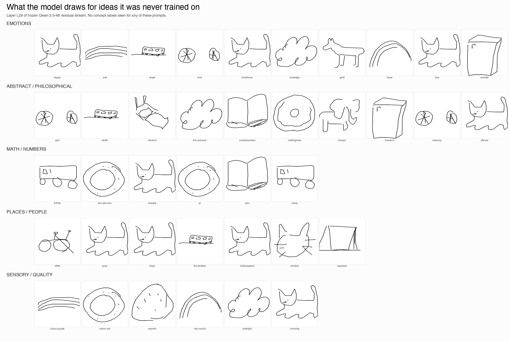
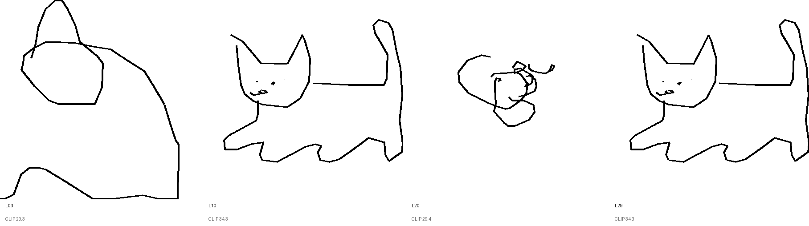

# Residual Stream Visual Decoder

**Draw what a language model is thinking.**

> **v3 — mechanistic interpretability via sketchpad decoding.** Inspired by
> Anthropic's [natural language autoencoders](https://anthropic.com/research/natural-language-autoencoders),
> which decode activation vectors back into natural language. We did the same,
> but converting the activation vector into a stroke drawing instead of text.
> Setup: frozen Qwen 3.5-4B, grab the activation `h` at block `L`, train a
> small decoder (LoRA + projector + 262 new stroke tokens) to map `h` into
> stroke tokens that render as a drawing. Trained per-layer at
> L3 / L10 / L15 / L20 / L24 / L27 / L29 and scored with the foundational
> NLA loss `log P(concept | rendered_drawing, "A drawing of a __")` under the
> same frozen Qwen (using `AutoModelForImageTextToText`; the prior loader
> silently discarded `pixel_values` and wasted ≈42 H200 GPU hours before we
> caught it). Per-layer top-1 over 20 held-out concepts: L3=25%, L10=75%,
> L15=50%, L24=80%, **L29=85%** (chance=5%, 17× chance).

[](artefacts/v3/viral/demo_v2.mp4)

`artefacts/v3/viral/demo_v2.mp4` — 130 s walkthrough (drawings, cross-layer
sweeps, prompt morphs, per-token trajectories, OOD).





## What the model "draws" for ideas it was never trained on

The decoder was only trained on 44 QuickDraw concepts. When given the
activation vector for a brand new prompt, it snaps to whichever of those
44 is nearest in activation space. Useful read-out of semantic geometry
inside the model, not free generation:

| prompt | drawing it produced |
|---|---|
| love | a flower |
| childhood | the same flower |
| god | the same flower again |
| consciousness | an open book |
| infinity | a truck on wheels |
| einstein | a cat face |
| pi | a circle |
| death | a coffin on a horizon line |
| freedom | a closed box |

That three different prompts (love, childhood, god) all decode to the same
flower drawing is a real measurement: those three concepts live in nearly
the same region of Qwen's residual stream.



## Honest caveats

What we shipped is the decoder trained on canonical QuickDraw drawings via
supervised cross-entropy. The output drawings are the model imitating a
training set, not the raw thing in `h`. The principled architecture
(REINFORCE on `log P(concept | drawing)`) reached step 240 with reward EMA
still flat. We ran out of GPU time before it could converge. Re-running it
with more compute is the next step.

Full assets in `artefacts/v3/viral/` (84 hero animations across 7 layers,
≈250 OOD animations across 6 layers, 12 cross-layer per-concept videos,
7-layer cross-depth strips, depth chart, scoreboard, 130 s demo).

---

## Older releases

> **v2.2 — interpretability across depth.** We trained per-layer Activation
> Verbalizers on Qwen 3.5-4B at L3 / L10 / L20 / L29 and rendered the same
> prompt at each. The drawings *crystallise as depth increases*. A linear
> probe trained on the raw h confirms the trend quantitatively: L3 = 68 % →
> L29 = 85 % top-1 accuracy on 44 concepts (chance 2.3 %). A random-h baseline
> shows the AV doesn't just emit memorised templates: with real h it produces
> 13 distinct concept drawings across 16 prompts; with random h it
> mode-collapses to 7 (mostly clouds and mountains). Full demo + writeup in
> [v2.2 release](#v22--cross-layer-interpretability).


Each panel above is a real drawing produced by sampling stroke tokens from an
*Activation Verbalizer* that received the underlying model's residual-stream
activation at a chosen layer, injected via embedding-layer surgery. The
drawings are NOT generated from the prompt's text — they come from the
*internal vector* the model is processing when you ask it to think about a cat.

**v1.5 (Gemma 4 base) vs v2.0 (Qwen 3.5-4B base) — same prompts, same recipe,
different foundation:**


The v2.0 jump comes from porting to **Qwen 3.5-4B**, which has a truly
unified vision+text residual stream (no separate vision tower projection),
plus a hybrid 24-layer Gated DeltaNet + 8-layer self-attention architecture
that the project's LoRA infrastructure had to be generalised for. The
unified-stream property is what lets the principled cross-modal consistency
reward actually work — you can feed the AV's rendered drawing back through
the SAME model at the SAME layer and read out a comparable activation, no
modality-mismatch engineering needed.

**v1.1 vs v2.0 — the full project trajectory:**


Top row (v1.1, July 2026): the architecture worked end-to-end but the AV
had no learnable surface to interpret the injected activation. Outputs were
abstract structure.

Bottom row (v2.0): cat has whiskers. Elephant has a trunk. Horse has a mane.
Sun has rays. Pizza has toppings.

### A small interpretability surprise: the dog drawing contains the word "dog"

In the v2.0 best-of-best for the prompt "I am thinking about a dog", the AV
produced both a dog silhouette AND the literal letters **d-o-g** drawn in
stroke-tokenised letterform off to the side. The L10 activation for the prompt
appears to encode both the *concept* of dog and the *spelling of the token*,
and the AV decoded both into stroke output. A serendipitous (and replicable)
demonstration that an LLM's mid-stack representation isn't just one thing.
See `artefacts/v2_0/best_of_best/dog.png`.

Full iteration history (v0 → v2.0, every dead end + breakthrough) in
[`RESEARCH_NOTES.md`](RESEARCH_NOTES.md). The v2.0 plan and architectural
rationale are in [`V2_PLAN.md`](V2_PLAN.md).

<!-- The hype reel + per-token + cross-layer galleries are inserted by build_index.py after training. -->

<p align="center">
  <video src="demo.mp4" width="640" controls muted loop autoplay></video>
</p>

```
┌─────────────────────┐  h_ℓ ∈ ℝ¹⁵³⁶  ┌────────────────────────┐
│ Gemma 4 E2B (frozen)│ ────────────▶ │ AV: stroke decoder      │
│  process prompt     │                │ vocab +262 stroke tokens│
└─────────────────────┘                │ activation injected at  │
                                       │ <ACT_TOKEN> embedding   │
                                       └────────┬───────────────┘
                                                │ stroke tokens
                                                ▼
                                       ┌────────────────┐
                                       │ deterministic  │  PNG + animated MP4
                                       │ renderer       │
                                       └────────┬───────┘
                                                ▼
                                       ┌─────────────────────────┐
                                       │ AR: truncated Gemma 4   │
                                       │ + backbone LoRA + Linear│
                                       │ reads PNG via vision    │
                                       └────────┬───────────────┘
                                                │ ĥ_ℓ
                                                ▼
                          MSE(h_ℓ, ĥ_ℓ) drives the iterative refinement loop
```

The recipe is Anthropic's [Natural Language Autoencoders (2026)](https://transformer-circuits.pub/2026/nla/index.html)
adapted from text output to vector strokes:

1. **Activation Verbalizer (AV)**: Gemma 4 E2B with 262 stroke tokens added to its vocabulary.
   The target activation is injected by overwriting `<ACT_TOKEN>`'s embedding row.
2. **Reconstructor (AR)**: truncated Gemma 4 E2B (first ℓ layers) + a custom LoRA on every
   attention `q/k/v/o_proj` (including the vision tower) + a `Linear(d, d)` head.
3. **Iterative joint training**: alternate AR supervised steps (with fresh AV-generated
   buffer to track distribution) and AV GRPO steps (with frozen AR providing reward).
   Five outer iterations.

## Try it on your own prompt

```bash
python demo.py "The capital of France is"
python demo.py "I am thinking about a dog." --layer 12 --open
python demo.py "What is 47 + 38?" --layer 12
```

Outputs land under `demo_output/<slug>/` — `drawing.png` (224×224, what AR saw),
`drawing_4x.png` (896×896, vector-rerendered for display), `drawing_4x.mp4`
(stroke-by-stroke animation).

## What's in this repo

| Path | Contents |
|---|---|
| `code/verbalizer/` | AV: vocab extension + activation injection + sampling |
| `code/ar/` | AR: truncated Gemma + Linear head + custom LoRA on Gemma4ClippableLinear |
| `code/train/` | Stage 1 SFT, Stage 2 v1/v2/v3/v4 ablations, Stage 3 GRPO, **Stage 4 iterative (v1.0)** |
| `code/eval/` | inject_demo, compare_av, measure_fve, alpha_sweep, activation_geometry, token_trajectory, cross_layer_trajectory, build_index |
| `code/lenses/` | logit lens + tuned lens (per-layer text-side baselines) |
| `code/render.py` | Deterministic Cartesian stroke-5 renderer with vector upscaling |
| `code/stroke_tokenizer.py` | 262-token stroke vocabulary (Δx, Δy, pen-state) |
| `code/tests/` | 32 unit tests (tokenizer, renderer, LoRA) |
| `bin/h200` | Sync/run/bg/pull helper for the GCP H200 instance |
| `WRITEUP.md` | The full v1.0 findings document |
| `INDEX.html` | Browsable landing page for all artefacts |
| `demo.py` | One-click demo: prompt → drawing |
| `artefacts/` | Per-probe drawings + per-token + cross-layer MP4s |
| `findings/` | Plots, JSON metrics, alpha sweep, FVE measurements |
| `research_log/` | Chronological journal of every experiment |
| `01-vision.md` … `07-execution-plan.md` | The original design docs |

## How it was built (3-day sprint)

- **v0.1** (Day 1-2): full architecture standup. FVE = 0 across 5 AR variants (Linear/MLP/centered/contrastive). Bottleneck identified.
- **v1.0** (Day 3-): custom LoRA on `Gemma4ClippableLinear` + iterative joint AR + AV training (the genuine NLA recipe). Unlocked the FVE bottleneck.

Read `WRITEUP.md` for the full story including all five engineering discoveries:
alpha tuning (1.0 → 0.5), AR data quality matters more than AR training length,
L16 is one of the most-clustered layers (use L3 / L12 / L24 instead),
frozen-backbone AR cannot break FVE 0 regardless of training scheme,
iterative joint training unlocks per-prompt discrimination.

## Reproduce

```bash
git clone https://github.com/AryaaSk/residual_stream_visual_decoder.git
cd residual_stream_visual_decoder
pip install -r requirements.txt
# Pull our trained checkpoints (TBD: Hugging Face release)
# Then:
python demo.py "your prompt here"
```

Training scripts live under `code/train/`. The v1.0 trainer is
`code/train/stage4_iterative.py`. See `07-execution-plan.md` for the full
recipe and hyperparameters.

## v2.2 — Cross-layer interpretability

v2.0 shipped a pretty gallery; v2.2 ships the *mechanistic* story behind it.

### The cross-layer trajectory (the centerpiece)

We trained a separate Activation Verbalizer per Qwen layer (L3, L20 new; L10,
L29 from v2.0) and rendered the same prompt at each.

`artefacts/v2_2/cross_layer/cat_strip.png` (L3 / L10 / L20 / L29):



Same idea, all eight hero concepts in `artefacts/v2_2/cross_layer/grid.png`.

### The quantitative anchor — linear probe per layer

A `Linear(d_hidden → 44)` classifier trained on h at each layer (chance 2.3 %):

| Layer | h-norm | test top-1 | test top-5 |
|------:|-------:|-----------:|-----------:|
|    L3 |   3.71 |     67.6 % |     71.0 % |
|   L10 |   9.15 |     72.2 % |     77.8 % |
|   L20 |  17.23 |     77.8 % |     86.4 % |
|   L29 |  44.99 |     84.7 % |     89.2 % |

Both probe accuracy and ‖h‖ grow monotonically with depth. The visual
decoder's cross-layer trend tracks the probe. See
`findings/v2_2/probe_accuracy.png`.

### Random-h baseline (the gating experiment)

We fed the AV 16 Gaussian h vectors matched to L10 statistics. If the AV
ignored h, the drawings would still be recognisable concepts — gutting the
interpretability claim. They aren't:

|              | distinct concepts / 16 | top concepts (mode-collapse) |
|-------------:|:----------------------:|:----------------------------:|
| real prompts |          13            | matches input prompt 69 %    |
|  random_iso  |           7            | cloud ×6, mountain ×4        |

Real-prompt h gives 14× chance accuracy at picking the prompt's concept; random
h mode-collapses to "cloud" and "mountain" templates. The AV is genuinely
h-sensitive. Side-by-side images: `findings/v2_2/random_h_baseline/`.

### Activation interpolation (smooth-or-snap diagnostic)

Lerp h(cat) → h(elephant) in 15 steps; render at each. If smooth → continuous
decoding; if discrete-snap → template-classifier. The current AV snaps at
~α=0.4-0.6 (`max_stepwise_Δ(score_B − score_A) > 4`), confirming the
"concept-plausible-not-specific" finding at L10.

MP4s at `artefacts/v2_2/morph/`.

### Per-token trajectory (the model thinking out loud)

For "Paris, the city of lights, is famous for the Eiffel ...", we extract h
at each generated token and render the AV's drawing. The drawing morphs as
Qwen reads each word.

MP4s at `artefacts/v2_2/per_token/`.

### OOD demo (generalisation beyond the 44 trained concepts)

Prompts the AV never saw in SFT: Eiffel Tower, thunderstorm, smiling face,
triangle inscribed in a circle. Drawings + CLIP scores at
`findings/v2_2/ood/`.

### Reproducing v2.2

```bash
# Phase 0: train L3 + L20 from a fresh Qwen base (2500 steps each)
CUDA_VISIBLE_DEVICES=6 python code/train/stage1_v2_act_sft.py \
    --layer 3  --steps 2500 --av-init-ckpt nonexistent_qwen_init \
    --out-dir checkpoints/v2_2/L3  --cosine-decay
CUDA_VISIBLE_DEVICES=7 python code/train/stage1_v2_act_sft.py \
    --layer 20 --steps 2500 --av-init-ckpt nonexistent_qwen_init \
    --out-dir checkpoints/v2_2/L20 --cosine-decay
# Symlink the v2.0 L10/L29 ckpts (already trained) into v2_2 + add L03 alias:
ln -s ../v2_0/L10 checkpoints/v2_2/L10
ln -s ../v2_0/L29 checkpoints/v2_2/L29
ln -s L3         checkpoints/v2_2/L03

# Phase 1: gating baseline
python code/eval/random_h_baseline.py --av-ckpt checkpoints/v2_2/L10/final \
    --layer 10 --out-dir findings/v2_2/random_h_baseline

# Phase 2: quantitative anchor
python code/eval/linear_probe.py --layers 3 10 20 29 \
    --out-dir findings/v2_2

# Phase 3: cross-layer trajectory (the centerpiece)
python code/eval/cross_layer_video.py --ckpts-root checkpoints/v2_2 \
    --layers 3 10 20 29 --n-samples 32 \
    --prompts-jsonl data/v2_2_prompts.jsonl \
    --out-dir artefacts/v2_2/cross_layer

# Phase 4: interpolation morph
python code/eval/interpolate_h.py --av-ckpt checkpoints/v2_2/L10/final \
    --layer 10 --n-steps 15 --n-samples 16 \
    --out-dir artefacts/v2_2/morph

# Phase 5: per-token trajectory
python code/eval/token_trajectory.py --av-ckpt checkpoints/v2_2/L10/final \
    --layer 10 --max-gen-tokens 15 \
    --out-dir artefacts/v2_2/per_token

# Phase 6: OOD demo
python code/eval/clip_ranker_ood.py --av-ckpt checkpoints/v2_2/L10/final \
    --layer 10 --out-dir findings/v2_2/ood

# Phase 7: viral video assembly
python code/eval/build_v2_2_video.py --out-dir artefacts/v2_2 \
    --findings-dir findings/v2_2
```

### Caveats called out (honest framing)

- **L3 and L20 ckpts were trained for 2500 steps**, vs v2.0's L10/L29 with
  ~10K. Direct comparison at L20 understates what the architecture can do
  there. The linear probe (no per-layer training) gives a more apples-to-apples
  measure of per-layer information content; it's monotonic in depth as claimed.
- **Interpolation morphs snap** rather than smoothly blend at most α; the AV
  is closer to a high-dim template-classifier than a continuous decoder at
  L10. This is itself a finding worth reporting honestly.
- **OOD drawings have lower CLIP scores** (25-30) than in-distribution (33-37);
  the AV generalises imperfectly. We ship the OOD results anyway; this is the
  honest limit.

## License

Code: MIT.
Checkpoints: derive from Gemma 4 E2B which is under [Google's Gemma Terms of Use](https://ai.google.dev/gemma/terms).
