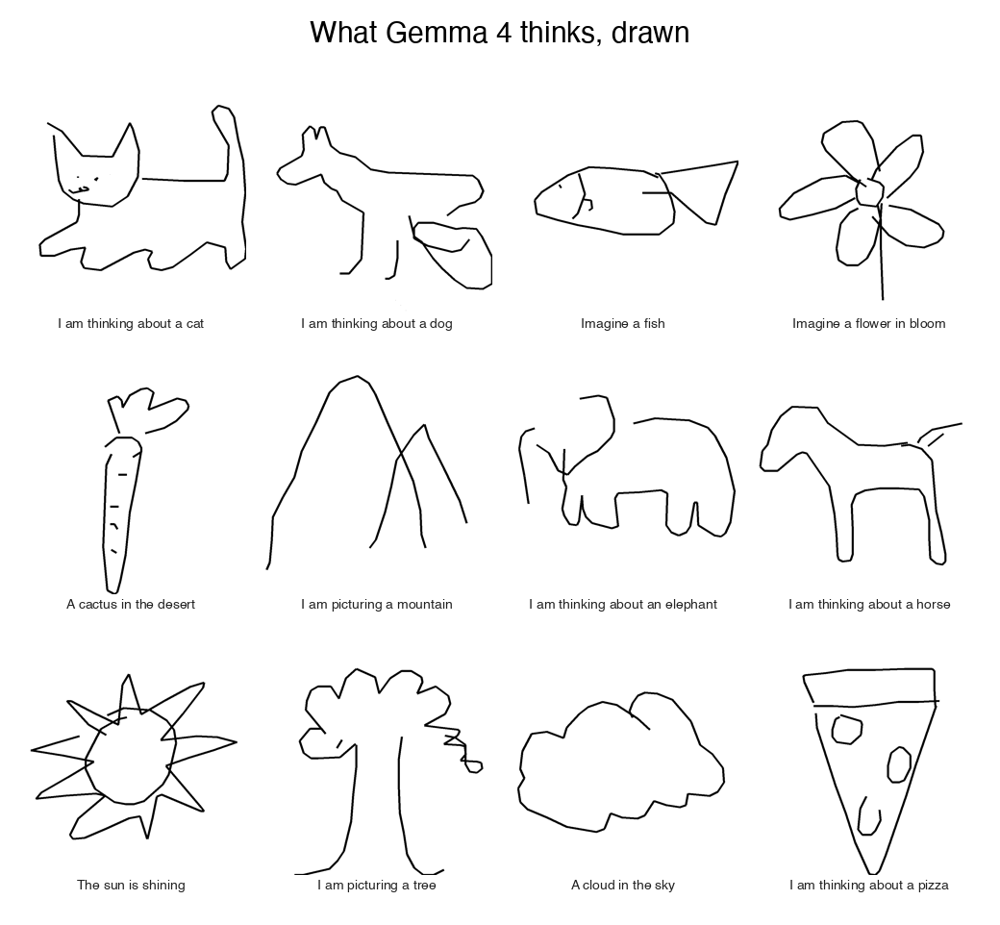
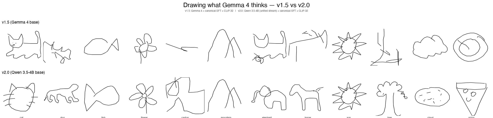
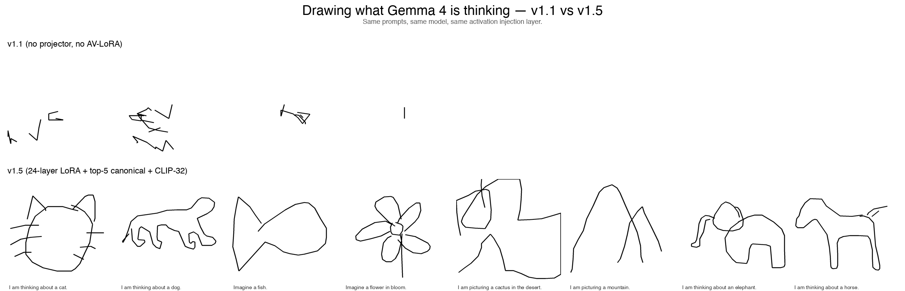

# Residual Stream Visual Decoder

**Draw what a language model is thinking.**



Each panel above is a real drawing produced by sampling stroke tokens from an
*Activation Verbalizer* that received the underlying model's residual-stream
activation at a chosen layer, injected via embedding-layer surgery. The
drawings are NOT generated from the prompt's text — they come from the
*internal vector* the model is processing when you ask it to think about a cat.

**v1.5 (Gemma 4 base) vs v2.0 (Qwen 3.5-4B base) — same prompts, same recipe,
different foundation:**



The v2.0 jump comes from porting to **Qwen 3.5-4B**, which has a truly
unified vision+text residual stream (no separate vision tower projection),
plus a hybrid 24-layer Gated DeltaNet + 8-layer self-attention architecture
that the project's LoRA infrastructure had to be generalised for. The
unified-stream property is what lets the principled cross-modal consistency
reward actually work — you can feed the AV's rendered drawing back through
the SAME model at the SAME layer and read out a comparable activation, no
modality-mismatch engineering needed.

**v1.1 vs v2.0 — the full project trajectory:**



Top row (v1.1, July 2026): the architecture worked end-to-end but the AV
had no learnable surface to interpret the injected activation. Outputs were
abstract structure.

Bottom row (v2.0): cat has whiskers. Elephant has a trunk. Horse has a mane.
Sun has rays. Pizza has toppings.

### A small interpretability surprise: the dog drawing contains the word "dog"

In the v2.0 best-of-best for the prompt "I am thinking about a dog", the AV
produced both a dog silhouette AND the literal letters **d-o-g** drawn in
stroke-tokenised letterform off to the side. The L10 activation for the prompt
appears to encode both the *concept* of dog and the *spelling of the token*,
and the AV decoded both into stroke output. A serendipitous (and replicable)
demonstration that an LLM's mid-stack representation isn't just one thing.
See `artefacts/v2_0/best_of_best/dog.png`.

Full iteration history (v0 → v2.0, every dead end + breakthrough) in
[`RESEARCH_NOTES.md`](RESEARCH_NOTES.md). The v2.0 plan and architectural
rationale are in [`V2_PLAN.md`](V2_PLAN.md).

<!-- The hype reel + per-token + cross-layer galleries are inserted by build_index.py after training. -->

<p align="center">
  <video src="demo.mp4" width="640" controls muted loop autoplay></video>
</p>

```
┌─────────────────────┐  h_ℓ ∈ ℝ¹⁵³⁶  ┌────────────────────────┐
│ Gemma 4 E2B (frozen)│ ────────────▶ │ AV: stroke decoder      │
│  process prompt     │                │ vocab +262 stroke tokens│
└─────────────────────┘                │ activation injected at  │
                                       │ <ACT_TOKEN> embedding   │
                                       └────────┬───────────────┘
                                                │ stroke tokens
                                                ▼
                                       ┌────────────────┐
                                       │ deterministic  │  PNG + animated MP4
                                       │ renderer       │
                                       └────────┬───────┘
                                                ▼
                                       ┌─────────────────────────┐
                                       │ AR: truncated Gemma 4   │
                                       │ + backbone LoRA + Linear│
                                       │ reads PNG via vision    │
                                       └────────┬───────────────┘
                                                │ ĥ_ℓ
                                                ▼
                          MSE(h_ℓ, ĥ_ℓ) drives the iterative refinement loop
```

The recipe is Anthropic's [Natural Language Autoencoders (2026)](https://transformer-circuits.pub/2026/nla/index.html)
adapted from text output to vector strokes:

1. **Activation Verbalizer (AV)**: Gemma 4 E2B with 262 stroke tokens added to its vocabulary.
   The target activation is injected by overwriting `<ACT_TOKEN>`'s embedding row.
2. **Reconstructor (AR)**: truncated Gemma 4 E2B (first ℓ layers) + a custom LoRA on every
   attention `q/k/v/o_proj` (including the vision tower) + a `Linear(d, d)` head.
3. **Iterative joint training**: alternate AR supervised steps (with fresh AV-generated
   buffer to track distribution) and AV GRPO steps (with frozen AR providing reward).
   Five outer iterations.

## Try it on your own prompt

```bash
python demo.py "The capital of France is"
python demo.py "I am thinking about a dog." --layer 12 --open
python demo.py "What is 47 + 38?" --layer 12
```

Outputs land under `demo_output/<slug>/` — `drawing.png` (224×224, what AR saw),
`drawing_4x.png` (896×896, vector-rerendered for display), `drawing_4x.mp4`
(stroke-by-stroke animation).

## What's in this repo

| Path | Contents |
|---|---|
| `code/verbalizer/` | AV: vocab extension + activation injection + sampling |
| `code/ar/` | AR: truncated Gemma + Linear head + custom LoRA on Gemma4ClippableLinear |
| `code/train/` | Stage 1 SFT, Stage 2 v1/v2/v3/v4 ablations, Stage 3 GRPO, **Stage 4 iterative (v1.0)** |
| `code/eval/` | inject_demo, compare_av, measure_fve, alpha_sweep, activation_geometry, token_trajectory, cross_layer_trajectory, build_index |
| `code/lenses/` | logit lens + tuned lens (per-layer text-side baselines) |
| `code/render.py` | Deterministic Cartesian stroke-5 renderer with vector upscaling |
| `code/stroke_tokenizer.py` | 262-token stroke vocabulary (Δx, Δy, pen-state) |
| `code/tests/` | 32 unit tests (tokenizer, renderer, LoRA) |
| `bin/h200` | Sync/run/bg/pull helper for the GCP H200 instance |
| `WRITEUP.md` | The full v1.0 findings document |
| `INDEX.html` | Browsable landing page for all artefacts |
| `demo.py` | One-click demo: prompt → drawing |
| `artefacts/` | Per-probe drawings + per-token + cross-layer MP4s |
| `findings/` | Plots, JSON metrics, alpha sweep, FVE measurements |
| `research_log/` | Chronological journal of every experiment |
| `01-vision.md` … `07-execution-plan.md` | The original design docs |

## How it was built (3-day sprint)

- **v0.1** (Day 1-2): full architecture standup. FVE = 0 across 5 AR variants (Linear/MLP/centered/contrastive). Bottleneck identified.
- **v1.0** (Day 3-): custom LoRA on `Gemma4ClippableLinear` + iterative joint AR + AV training (the genuine NLA recipe). Unlocked the FVE bottleneck.

Read `WRITEUP.md` for the full story including all five engineering discoveries:
alpha tuning (1.0 → 0.5), AR data quality matters more than AR training length,
L16 is one of the most-clustered layers (use L3 / L12 / L24 instead),
frozen-backbone AR cannot break FVE 0 regardless of training scheme,
iterative joint training unlocks per-prompt discrimination.

## Reproduce

```bash
git clone https://github.com/AryaaSk/residual_stream_visual_decoder.git
cd residual_stream_visual_decoder
pip install -r requirements.txt
# Pull our trained checkpoints (TBD: Hugging Face release)
# Then:
python demo.py "your prompt here"
```

Training scripts live under `code/train/`. The v1.0 trainer is
`code/train/stage4_iterative.py`. See `07-execution-plan.md` for the full
recipe and hyperparameters.

## License

Code: MIT.
Checkpoints: derive from Gemma 4 E2B which is under [Google's Gemma Terms of Use](https://ai.google.dev/gemma/terms).
