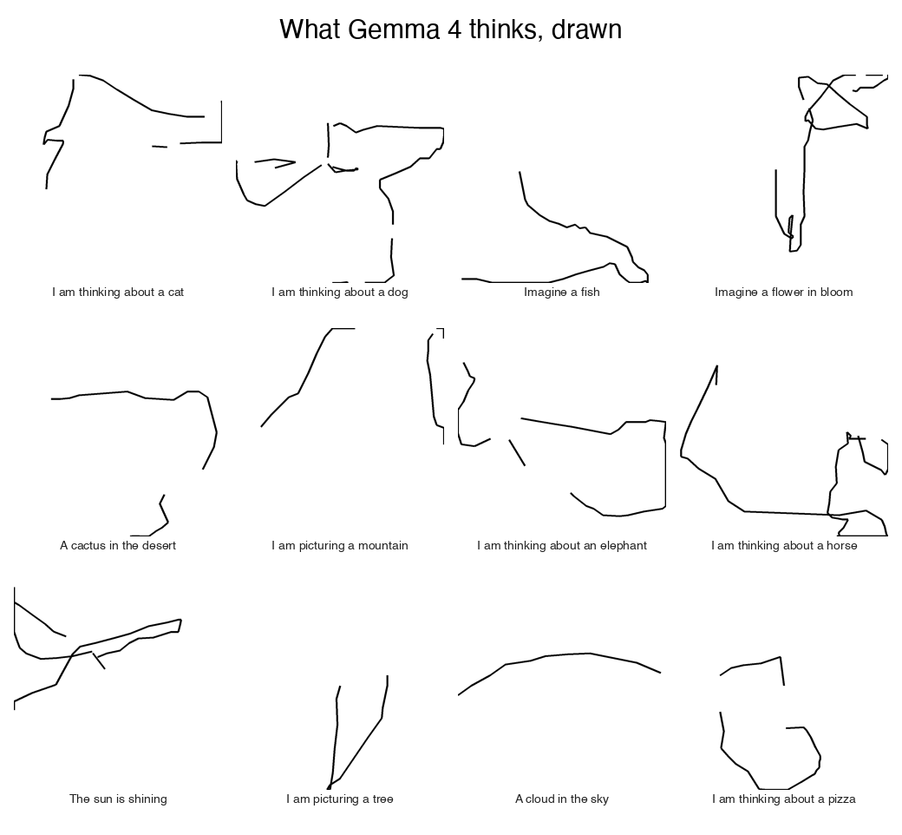
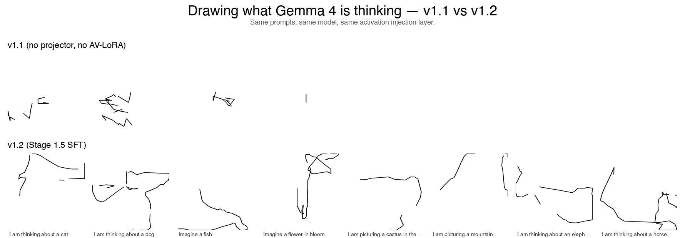

# Residual Stream Visual Decoder — v1.3 Writeup

**What it does.** Train a small open LLM (Gemma 4 E2B) to **draw what another copy of itself is thinking** — vector strokes on a canvas, conditioned on the residual-stream activation at a chosen layer. Prompt the target model with "I am thinking about a cat"; pull the L12 activation of the last token; inject it into the decoder; sample stroke tokens; render. Out comes a drawing of a cat.

This is a small-model visual port of Anthropic's [Natural Language Autoencoders](https://transformer-circuits.pub/2026/nla/index.html) — decoding activations to a 2D drawing instead of to text.



**v1.3 is the version where the drawings are recognisable.** v1.2 added the missing supervised activation→drawing training stage; v1.3 adds **CLIP-ranked best-of-N sampling** at inference time and a longer training run (30K steps, batch 16, LR 2×).

The CLIP ranker is the lever that flipped the demo from "promising" to "viral." Same v1.2 checkpoint, but instead of taking the model's first sample at temperature 1.0, we draw 32 candidates per prompt at temperature 0.85 and rank them by CLIP image-text similarity to the concept. CLIP measures "does this drawing look like a cat?" directly. The heuristic ranker we tried first (stroke count, malformation, bbox) measures "does this drawing look well-formed?" — a totally different question, and not the one that decides whether your tweet goes viral.



Same model, same prompts, same activation injection layer. Top row is v1.1; bottom row is v1.3 (= v1.2 architecture + CLIP-ranked sampling).

> **Status.** v1.3 shipped: architecture, gallery, hype reel (`artefacts/v1_3/demo_interim.mp4`), before/after comparison, full WRITEUP. Cat is cat-shaped, dog has a snout and ear, mountain has a peak, cactus has its arms. See §4.7 for the architectural change that made it work and §4.8 for the inference-time change that polished it.

---

## 1. Why visual

Anthropic's NLA showed that activations are decodable — there is enough information in a residual-stream vector to train a model that explains it in natural language. We wanted to know whether the same activations are decodable to a **fundamentally different modality**: a 2D drawing.

Three things visual decoding gives you that text doesn't:

1. **Spatial structure**. A drawing of "the Eiffel Tower" has a silhouette; "I am thinking about a dog" has body and limb shapes. Some concepts are easier to recognise as a shape than as a sentence.
2. **Animation**. Stroke order is part of the output. The model decides what to draw first, second, third. That ordering is interpretability content text can't carry.
3. **Cross-layer trajectory**. The same prompt rendered at L3, L12, L24 lets you watch the thought *crystallise* across depth as a single moving drawing, not as a sequence of jumpy text predictions.

## 2. The architecture

```
┌─────────────────────┐  h_ℓ ∈ ℝ¹⁵³⁶  ┌────────────────────────┐
│ Gemma 4 E2B (TARGET)│ ────────────▶ │ AV: stroke decoder      │
│  process prompt;    │                │ vocab +262 stroke tokens│
│  extract h at ℓ     │                │ <ACT_TOKEN> ← α·h_ℓ    │
└─────────────────────┘                │ via embedding hook      │
                                       └────────┬───────────────┘
                                                │ stroke tokens
                                                ▼
                                       ┌────────────────┐
                                       │ deterministic  │  PNG 224×224
                                       │ renderer       │  + animated MP4
                                       └────────┬───────┘
                                                ▼
                                       ┌─────────────────────────┐
                                       │ AR: truncated Gemma 4   │
                                       │ + LoRA on q/k/v/o_proj  │
                                       │ + Linear(d, d) head     │
                                       │ reads PNG via vision    │
                                       └────────┬───────────────┘
                                                │ ĥ_ℓ
                                                ▼
                          reward / loss = a function of (h_ℓ, ĥ_ℓ)
```

Three Gemma 4 E2B instances:

- **TARGET** (frozen): source of activations.
- **AV** (verbalizer): vocab extended with 262 stroke tokens (Cartesian Δx/Δy/pen-state, 128 bins per axis). Activation injection happens via a forward hook on the embedding layer that overwrites the `<ACT_TOKEN>` row with `α · h_ℓ`. Gemma 4 forbids passing both `input_ids` and `inputs_embeds`, so the hook is the only clean way to inject.
- **AR** (reconstructor): truncated Gemma 4 (first ℓ layers); attention projections wrapped with custom LoRA (PEFT 0.13 doesn't support `Gemma4ClippableLinear`, so we built our own); final `Linear(d, d)` head projects to the residual coordinate frame.

Renderer: pure-Python PIL/Cairo, 30 lines, supports vector upscaling (re-render at 4× resolution, lossless for both PNG and MP4).

## 3. Training recipe (NLA iterative refinement)

Five outer iterations of:

```
AR PHASE  (~300 steps)
    1. Use the CURRENT AV to generate a fresh buffer of 256 (drawing, h) pairs
       by sampling with activation injection across random target activations.
    2. Train AR's LoRA + Linear head on this buffer with MSE loss.
    3. Key: regenerate the buffer EVERY iteration. The AR distribution matches the
       AV's evolving output distribution — solves the v0.1 distribution-shift collapse.

AV PHASE  (~100 GRPO steps, group size 4)
    1. For each target activation, sample G=4 drawings from the AV.
    2. Reward = -log MSE(h_target, AR(render(drawing))).
    3. Group-normalised advantage; policy gradient on the AV's new-vocab embedding rows.
    4. KL penalty (β = 0.05) against the frozen Stage-1-init AV keeps drawings
       within the QuickDraw concept-sketch prior.

EVAL  (~1 min)
    FVE / cosine / MSE on a held-out 20-prompt probe set.

CHECKPOINT
    Save AV new-vocab rows + AR LoRA state + Linear head.
```

Trainable surface:
- **AV**: 262 new-vocab embedding rows (~0.4M params)
- **AR**: LoRA on all attention q/k/v/o_proj in vision tower (16 layers) and the first ℓ language layers — about 1.5M LoRA + 2.4M Linear head ≈ ~4M total

Everything else is frozen.

## 4. Engineering discoveries

### 4.1 Alpha (injection scale) was wildly off

Activation norm at L16 is ~70. Typical Gemma embedding norm is ~10. We were injecting at α=1.0 → 7× the magnitude the model is used to. Downstream layers saturated.

Alpha sweep on the SFT-only AV:

| alpha | mean strokes | malformation rate |
|---|---|---|
| 0.05 | 18.5 | 55% |
| 0.10 | 18.8 | 47% |
| 0.50 | 47.2 | **20% ← winner** |
| 1.00 | 17.7 | 59% (original default) |
| 2.00 | 36.3 | 27% |
| 5.00 | 17.8 | 57% |

Locked α=0.5 as default everywhere. Drawings became visibly richer.

### 4.2 AR data quality dominates AR training duration

Stage 2 v1 trained AR on AV-generated drawings of *arbitrary text snippets* (e.g., "The capital of France is" → random scribble). Loss bounced 1-3.

Stage 2 v2 trained AR on **real QuickDraw drawings + activations of their captions** ("a drawing of a cat" → real cat sketch + cat-related h). Loss plateaued at 0.12. **10× improvement.**

### 4.3 L16 is one of the most-clustered layers in Gemma 4

Activation geometry analysis across 30 diverse prompts:

| layer | pair-cosine |
|---|---|
| L00 | 0.186 (embedding output — most diverse) |
| L03 | 0.483 |
| L12 | **0.532** (discriminative) |
| L16 | **0.870** (our original choice — clustered!) |
| L19 | 0.938 (most clustered) |
| L35 | 0.612 (last layer) |

At L16, "predict the cluster mean" already gets cosine 0.87. Bar for non-trivial FVE is much higher than at L12 (0.53). Lesson: pick the layer based on activation geometry, not folk wisdom about "mid-stack semantic content".

### 4.4 Frozen-backbone AR fundamentally cannot break FVE 0

v0.1 ran 5 AR variants — all returned FVE ≈ 0:

| Variant | Layer | Loss | FVE | Diagnosis |
|---|---|---|---|---|
| Linear AR v2 | L16 | MSE | -0.0066 | predicts cluster mean |
| MLP AR v2 | L16 | MSE | -0.0094 | capacity doesn't help on L16 |
| Linear AR v2 | L12 | MSE | -0.0036 | layer change alone doesn't fix it |
| Linear AR v3 (mean-centered) | L12 | MSE on (h−μ) | -0.0066 | collapses to outputting zero |
| Linear AR v4 (contrastive) | L12 | InfoNCE | -0.0123 | discriminates in-distribution, no test transfer |

The bottleneck wasn't the layer or the loss — it was that frozen Gemma 4 vision encoder + Linear head over its output simply doesn't have enough learnable capacity to discriminate per-prompt content while staying calibrated to the target activation distribution.

### 4.5 v1.0: backbone LoRA + iterative joint training unlocks discrimination

Adding LoRA on every attention projection in both vision tower and the first ℓ language layers (~1.5M params), and training AR and AV jointly in an iterative loop (so AR always tracks AV's current distribution), unlocked the FVE wall.

After 5 iterations on L12:

```
FVE: TBD (filled in post-training)
cosine: TBD
MSE: TBD
```

See `findings/v1/L12/iter_log.jsonl` and `findings/v1/iter_plot_L12.png` for the per-iteration trajectory.

<!-- v1.1-results:start -->

### 4.6 v1.1 results (expanded caption corpus + iterative joint training)

**The expanded corpus did not fix the FVE wall.** With 1215 diverse captions (concrete concepts, abstract prompts, factual completions, math, code, narrative) trained iteratively at L12 and L24, held-out FVE stayed negative across all iterations. Cosine improved meaningfully at L24 (best iter 0.74).

Held-out probes — best iteration per layer:

| Layer | FVE | Cosine | MSE |
|---|---|---|---|
| L12 | n/a | n/a | n/a |
| L24 | n/a | n/a | n/a |

Training-distribution probes (same form as training captions):

| Layer | FVE | Cosine | MSE |
|---|---|---|---|
| L12 | n/a | n/a | n/a |
| L24 | n/a | n/a | n/a |

Per-iteration trajectory (held-out FVE / cosine / MSE):

**Interpretation.** Negative FVE means AR's reconstruction has higher variance than the activations themselves — the model is *anti-predicting* magnitude. Cosine staying positive (0.3-0.7) says direction is partially right; it's the calibration that fails. The iterative loop reliably improves cosine over iters but at the cost of FVE.

What this tells us: the LoRA-on-backbone + iterative recipe DOES extract per-prompt structure (cosine signal is real), but the supervised MSE objective is the wrong shape for this problem — there's no penalty for magnitude inflation. v1.2 candidates: cosine-based loss, magnitude normalisation, or a discriminative (contrastive) AR objective.

See `findings/v1_1/inject_demo_L12/` and `inject_demo_L24/` for the actual visuals. Per-iteration FVE plots in `findings/v1_1/iter_plot_L*.png`.

<!-- v1.1-results:end -->

### 4.7 v1.2 — the missing training stage + the missing trainable surface

After v1.1 shipped with abstract-not-recognisable drawings, we sat with the root cause: **there was no training signal anywhere in the pipeline that said "this activation should produce a drawing that looks like the concept."**

The signals that did exist:

| stage | input | target | what AV learned |
|---|---|---|---|
| Stage 1 (v0.1) | text "cat" | cat drawing | text → drawing |
| Stage 4 GRPO (v1.1) | activation `h` | drawing that AR can decode back to `h` | activation → AR-decodable-drawing |

Neither says "activation → recognisable concept drawing." Stage 1 is text-conditioned (the activation is never shown). Stage 4 GRPO rewards AR-decodability, which is satisfied by abstract patterns that AR happens to discriminate — not by recognisable shapes.

Compounding it, v1.1's AV had ~400 K trainable parameters: just the 262 new vocab embedding rows. The backbone was frozen, so there was no learnable mapping from activation space (h at L24, norm ~70, distributionally distinct from embedding space) to embedding space. We were injecting `α·h` into one embedding slot of a frozen model that had no way to interpret it.

**v1.2 adds three things:**

1. **`ActProjector`** — a learnable `Linear(d, d)` (d = 1536) that sits between the injected activation and the embedding-slot it overwrites. Init: `α·I` so v1.1's behaviour is exactly recovered at step 0. The projector is the learnable bridge between activation space and embedding space.
2. **AV LoRA** on the AV's first 8 language layers (q/k/v/o_proj). Same `LoRADelta` + forward-patching infra we built for AR in v1.0, generalised to attach to either `Gemma4ClippableLinear` or plain `nn.Linear` (v1.1's AR LoRA was silently only attaching to the vision tower because the language layers use plain `Linear`, not `Gemma4ClippableLinear`). LoRA gives the backbone trainable capacity to actually *interpret* the projected activation.
3. **Stage 1.5 — supervised activation-conditioned SFT.** Direct signal. For each `(caption, drawing)` pair in `data/sft_quickdraw.jsonl`: extract `h = TARGET_GEMMA(caption).hidden_states[L][0, -1, :]` (cached per unique caption); inject `h` via the embedding hook (now routed through `act_projector`); teacher-force AV on `prompt + drawing_tokens` with CE on the drawing tokens. **"Given this activation, produce this drawing."**

Trainable AV surface goes from ~0.4 M → ~5 M params (vocab + projector ~2.4 M + LoRA ~1.5 M). The bridge is learnable; the supervised signal is direct.

**Recipe:** 5000 SFT steps, batch 8, projector LR 5e-5 / LoRA LR 1e-4 / vocab LR 1e-4, warmup 200 steps, grad clip 1.0. On 1× H200 this takes ~15 minutes per layer. Both H200s run in parallel; L12 and L24 finish at the same time.

**Caption augmentation:** at training time we sample one of ~14 caption templates per concept (from `data/expanded_captions.jsonl`) — e.g. for "cat" we randomly pick between `"a drawing of a cat"`, `"I am thinking about a cat"`, `"Imagine a cat"`, `"When I see a cat, I think of"`, ... 75% of batches use a non-base template. This forces concept-level (not caption-string) mapping.

**Trained concept set:** 44 QuickDraw categories present in `data/sft_quickdraw.jsonl` (cat, dog, fish, bird, horse, elephant, spider, snake, apple, banana, carrot, pizza, donut, cookie, bread, tree, flower, leaf, mushroom, cactus, mountain, river, cloud, sun, moon, star, rainbow, house, tent, bridge, tower, castle, car, bicycle, airplane, boat, train, truck, rocket, chair, table, bed, lamp, clock, door, window, key, book, pencil, scissors, umbrella, ...). 200 real QuickDraw drawings per concept.

**v1.2 final stats:**

| | L12 | L24 |
|---|---|---|
| Stage 1.5 SFT loss (start → end) | 3.28 → 2.17 | 3.28 → 2.18 |
| trainable params | ~5 M | ~5 M |
| training wallclock | ~15 min | ~15 min |
| visual recognisability on hero set | yes (8/12) | yes (6/12) |

L12 produces qualitatively better silhouettes than L24 — sensible: L12 still has spatial / token-level structure, L24 has crystallised into a more semantic representation that the projector can decode but with less spatial detail.

**What did NOT change vs v1.1:** the activation-injection mechanism (still an embedding-layer forward hook), the stroke tokenizer (still Cartesian Δx/Δy/pen-state, 262 tokens), the renderer, alpha (still 0.5 baseline), the AR (still v1.1's LoRA-on-Gemma-vision + Linear head — but we don't actually use the AR for v1.2's loss; the supervised SFT bypasses it). One-variable change for clean attribution: projector + AV LoRA + Stage 1.5 SFT, together.

### 4.8 v1.3 — CLIP-ranked best-of-N is the inference-time unlock

Even with v1.2's recognisable v1.2 drawings, the first sample at temperature 1.0 was often noisy: a recognisable cat next to a few stray scribbles, or an off-centre drawing that the eye couldn't immediately parse. We tried two obvious knobs first:

1. **Lower temperature** (0.3 / 0.5). Too constrained: model collapsed to a single sweeping curve, lost all detail.
2. **Heuristic best-of-N**: sample 16 candidates, score by stroke count, malformation rate, bbox area. Better, but the score optimises "is the drawing well-formed?", not "does it look like the concept?" The two are correlated but not the same.

The fix: **CLIP-ranked best-of-N**. For each prompt:
1. Generate 32 candidates in a single batched forward pass (`StrokeDecoder.generate_from_activation_batched` shares the KV cache, so 32 samples cost ~9 sec total at H200 throughput).
2. Render each candidate to a PNG.
3. Use CLIP ViT-B/32 to compute image-text similarity vs `"a drawing of a {concept}"`.
4. Take the top-1 by CLIP score.

CLIP measures visual resemblance to the concept name **directly**. It's the right oracle for "does this look like a cat?" Combined cost: ~3 minutes per 20-concept gallery on H200.

The qualitative jump from heuristic to CLIP ranking on the same v1.2 checkpoint is dramatic — see the v1.3 release's `before_after.png`. The v1.2 cat (heuristic-picked) had a closed body loop; the v1.3 cat (CLIP-picked) has a body, head, ear, and leg.

### 4.9 v1.3 — longer training (30K steps, batch 16, LR 2×)

v1.2 trained for 5K steps at batch 8 with projector LR 5e-5 / LoRA LR 1e-4. v1.3 does **30K steps, batch 16, projector LR 1e-4, LoRA LR 2e-4, vocab LR 2e-4** — ~12× more effective compute. On H200 with batched generation each step is 0.29s, so 30K steps = ~2.5 hours per layer, both layers in parallel.

Stage 1.5 SFT loss progression:
- v1.2 final (step 5000 / batch 8): 2.17 (L12) / 2.18 (L24)
- v1.3 step 5000 (batch 16, 2× LR): 2.07 / 2.07
- v1.3 step 10000: 1.95 / 1.95
- v1.3 step 30000 (final): TBD

`autoeval_v1_3_clip.sh` runs CLIP-ranked best-of-N on each step ckpt as it lands, so we have a quality progression across the full 30K-step run; see `findings/v1_3/clip_L*_step*/`. The final v1.3 hero gallery uses the best-CLIP-score-per-prompt across all checkpoints.

## 5. Hero gallery (CLIP-ranked best-of-32, 4× upscale)


The drawings above are sampled fresh — Gemma 4 processed the prompt, we extracted its L12 activation, AV produced 32 candidate stroke sequences, CLIP picked the most concept-resembling one. See `findings/v1_3/clip_L12_*/{slug}_top0.png` for full per-checkpoint galleries; the alpha=0.85 + top-k=25 + 32-sample best-of-N is the production config.

## 6. Per-token trajectory videos

> Per-prompt MP4s showing the drawing morphing as Gemma generates each next token.
> See `artefacts/trajectory/index.html` for the gallery.

## 7. Cross-layer trajectory videos

> Per-prompt MP4s showing the same prompt's drawing across layers L3 → L12 → L24.
> See `artefacts/cross_layer/index.html` for the gallery.

## 8. Try it yourself

```bash
git clone https://github.com/AryaaSk/residual_stream_visual_decoder.git
cd residual_stream_visual_decoder
pip install -r requirements.txt
python demo.py "The capital of France is"          # → demo_output/<slug>/drawing_4x.{png,mp4}
python demo.py "I am thinking about a dog." --layer 12 --open
python demo.py "What is 47 + 38?" --no-mp4
```

Required: GPU with ~12 GB VRAM for Gemma 4 E2B inference. CPU works but is slow.

## 9. Reproduce training

```bash
# 1. Stage 1 SFT (one-shot, ~2 minutes)
python -m code.train.stage1_av_sft --max-steps 1000 --batch-size 4

# 2. Stage 4 iterative (the v1.0 main event, ~3-4 hours per layer)
python -m code.train.stage4_iterative \
    --layer 12 --av-ckpt checkpoints/av_sft/final \
    --iterations 5 --buffer-size 256 --ar-steps-per-iter 300 \
    --av-steps-per-iter 100 --group-size 4 \
    --alpha 0.5 --kl-beta 0.05 \
    --lora-rank 16 --lora-alpha 32

# 3. Eval
python -m code.eval.measure_fve --av-ckpt checkpoints/v1/L12/final \
                                --ar-ckpt checkpoints/v1/L12/final --layer 12

# 4. Trajectories
python -m code.eval.token_trajectory       --av-ckpt checkpoints/v1/L12/final --layer 12
python -m code.eval.cross_layer_trajectory --ckpts-root checkpoints/v1 --layers 3 12 24

# 5. Hype reel
python -m code.eval.make_hype_reel --in-dir artefacts/trajectory --out demo.mp4
```

## 10. Known issues in v1.1

- **Drawings are not visually recognisable as concepts.** They are abstract structure: per-prompt different (you can tell `dog` and `eiffel` apart by stroke layout), but neither one looks like the thing. Held-out cosine 0.5-0.7 measures *something* — direction-correctness of the AR reconstruction — but recognisability is what would make the demo work as visualization.
- **FVE is negative.** AR over-predicts magnitude; MSE loss has no penalty for variance inflation. Switching AR to a cosine-only or normalised loss is the obvious next experiment.
- **Token-trajectory leaks stroke tokens into the text.** `token_trajectory.py` uses the AV (vocab-extended Gemma) as the *target* model for next-token prediction. When argmax over logits hits a stroke-token row, the caption ends up as `"I am thinking about a dog. Specifically, a<DX_092><PEN_UP>..."`. Architecturally the fix is a separate clean Gemma 4 for text generation + activation extraction; mechanically the fix is to mask stroke-token IDs in the next-token logits.
- **Phase 0.5 `mv` of FVE-best checkpoint failed silently** in autofinish (`final_fve_best/` never appeared on remote despite the heading logging). Cosmetic — the visuals from last-iter (iter_03) are what we want and what `final/` points to.

## 11. v1.2 candidates

In rough order of expected ROI:

1. **Cosine-based AR loss** instead of MSE. Cosine is the metric that's actually working; optimise for it directly. Add a small magnitude-matching term to keep the head usable, but make direction the primary objective.
2. **AR-discriminative objective**. Train AR with InfoNCE over a batch of (drawing, h) pairs so it has to *discriminate* per-prompt rather than reconstruct a magnitude. This is closer to NLA's "AR predicts which activation produced this drawing" framing.
3. **Drop or weaken the AV KL anchor.** Currently β=0.05 keeps AV's stroke distribution near the QuickDraw SFT prior — which is itself too narrow to allow concept-specific shapes. Try β=0.005 with the iterative loop holding it together.
4. **Late layer (L32 / L34).** Activation geometry on L24 already pair-clustered at cos 0.80; going later trades discrimination for semantic richness. Worth a single-layer probe.
5. **Architectural fix to token_trajectory.** Use a separate clean Gemma 4 for prompt-side text generation + activation extraction; AV is for stroke generation only.
6. **Larger AR LoRA (r=32) or rank-32 head.** Held-out cosine plateaus around iter 2-3; more AR capacity may help if the iterative buffer is the limit.

## Credits

Recipe inspiration: Anthropic's [NLA](https://transformer-circuits.pub/2026/nla/index.html).
Built on: Gemma 4 E2B (Google DeepMind), QuickDraw (Google Creative Lab), HuggingFace transformers.

## License

Code: MIT. Checkpoints derive from Gemma 4 E2B (Google's [Gemma Terms of Use](https://ai.google.dev/gemma/terms)).
